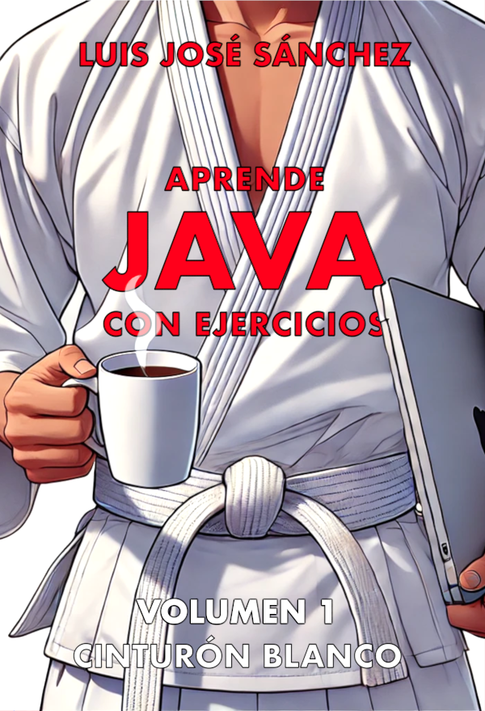

# COLECCIÓN "APRENDE JAVA CON EJERCICIOS"

La colección **Aprende Java con Ejercicios** es una obra práctica para aprender a programar en **Java** sin conocimientos previos. Está dividida en varios volúmenes identificados con cinturones de distintos colores que se corresponden con diferentes contenidos y niveles de dificultad.

## VOLUMEN 1 - CINTURÓN BLANCO

Este libro es el primer volumen de la colección. Comienza desde cero con un sencillo Hola mundo y abarca la salida por pantalla, la definición de variables, los tipos de datos, los operadores, la sentencia condicional y los bucles.

Cada capítulo se ilustra con numerosos ejemplos y, al final de cada uno de ellos, se plantean ejercicios de diferente dificultad.

El libro incluye un apéndice con todas las soluciones a los ejercicios.

Consigue tu ejemplar en Amazon: <https://www.amazon.es/dp/B0DT3XMF5C>
